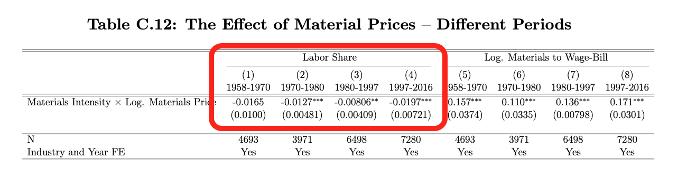
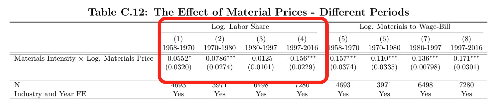

# Paper Identification

|  |   |
| ---  |  -------|
| ID  |   |
| Author  |   |
| Title  |   |
| Iteration |   |

Some useful information up front:

- [JPE Data and Code Availability Policy](https://www.journals.uchicago.edu/journals/jpe/datapolicy)
- [Step by step guidance from Data Editor for Authors](https://jpedataeditor.github.io/) 
- [Template README](https://social-science-data-editors.github.io/template_README/)

# Summary

In assessing compliance with our [Data and Code Availability Policy](https://www.journals.uchicago.edu/journals/jpe/datapolicy), our reproducibility team has identified the following issues, which we ask you to address:

1. Data Editor's first point.
2. Data Editor's second point.

# General

- [x] Data Availability and Provenance Statements
  - [x] Statement about Rights - Part 1: Right to use the data (e.g. *did the authors lawfully obtain the data*)
  - [ ] Statement about Rights - Part 2: Right to publish the data (e.g. *are human subjects involved and did permission been granted to publish their data?*)
  - [x] License for Data (optional, but recommended)
  - [x] Details on each Data Source
- [x] Dataset list
- [x] Computational requirements
  - [x] Software Requirements
  - [ ] Controlled Randomness (as necessary)
  - [x] Memory, Runtime, and Storage Requirements
- [ ] Description of programs/code
  - [ ] License for Code (Optional, but recommended) 
- [ ] {REPLICATOR} to Replicators
  - [ ] Details (as necessary)
- [x] List of tables and programs
- [x] References (Optional, but recommended) 


# High-level Description of Research Project

*This research project...*

- [x] uses observational data.
- [ ] uses *confidential* observational data.
- [ ] uses data generated via experiment or trial by the authors (in field or lab).
  - [ ] For lab experiments: The code to implement the experimental protocol (z-Tree, o-Tree etc) is included in the package.
  - [ ] A PDF copy of IRB approval is contained in the package.
  - [ ] A PDF document outlining the design of the experiment, including information on the selection and eligibility of participants is included.
  - [ ] A PDF copy of the instructions given to participants in both original language and an English translation is included.
- [ ] uses data generated via survey by the authors (in field or online)
  - [ ] The programs used to administer the survey (e.g. qualtrics survey file) are included.
  - [ ] A PDF copy of IRB approval is contained in the package.
  - [ ] A PDF of the original questionaire(s) and information on the selection and eligibility of participants is included.
- [ ] is a simulation study: the data are generated by an algorithm.
- [ ] is a numerical illustration: no data are used but code is used to produce illustrative output (tables, figures)


# Data description

## Data Sources

| file/name | public | private | shared with us | DOI/URL | Access described | cited readme | cited paper |
|---|---|---|---|---|---|---|---|
| `data/raw/aggregate/` - 15 FRED series | yes | no | yes | yes | no | yes | no |
| `data/raw/aggregate/nipaQuarterly.csv` - BEA NIPA | yes | no | yes | yes | no | yes | no |
| `data/raw/aggregate/fernald.xlsx` - Fernald quarterly TFP | yes | no | yes | yes | no | no | no |
| Four historical/current BEA aggregate workbooks in `data/raw/aggregate/` | yes | no | yes | yes | no | yes | no |
| Five 2025 BEA workbooks in `data/raw/model_inputs/` | yes | no | yes | yes | no | yes | no |
| `data/raw/external_gas_prices.csv` - EIA natural-gas prices | yes | no | yes | yes | no | yes | no |
| `data/raw/BEA-KLEMS/BEA-BLS-industry-level-production-account-1987-2021.xlsx` | yes | no | yes | yes | no | yes | no |
| `data/raw/BIS/mod.csv` - BIS exchange rates | yes | no | yes | yes | no | yes | no |
| `data/raw/census/NAICSUseDetail.txt` - BEA 1997 Use table | yes | no | yes | yes | no | yes | no |
| `data/raw/census/concentration_ratios/` - Economic Census concentration files | yes | no | yes | yes | no | yes | no |
| `data/raw/cepii_tuv/` - CEPII Trade Unit Values | yes | no | yes | yes | no | yes | no |
| `data/raw/comtrade/` - UN Comtrade extracts | yes | no | yes | yes | no | yes | no |
| `data/raw/disaster_iv/disaster_iv_baci_*` - CEPII BACI | yes | no | yes | yes | no | yes | no |
| `data/raw/disaster_iv/disaster_iv_emdat.xlsx` - EM-DAT Archive | yes | no | yes | yes | yes | yes | no |
| Two EU KLEMS 2025 files in `data/raw/EUKLEMS/` | yes | no | yes | yes | no | yes | no |
| `data/raw/EUKLEMS/EUKLEMS_2020vintage.dta` - EU KLEMS 2019 release | yes | no | yes | yes | no | yes | no |
| World KLEMS Canada 2012 and Korea 2015 workbooks | yes | no | yes | no | no | yes | no |
| `data/raw/EUKLEMS/WIOD/` - 43 WIOD national I-O workbooks | yes | no | yes | yes | no | no | no |
| `data/raw/misc/CMO-Historical-Data-Annual.xlsx` - World Bank Pink Sheet | yes | no | yes | yes | no | yes | no |
| `data/raw/NBER-CES/` - three NBER-CES files | yes | no | yes | yes | no | no | no |
| `data/raw/regional_data/QCEW/` - 31 BLS QCEW files | yes | no | yes | no | no | yes | no |
| Two BEA county files in `data/raw/regional_data/bea_county/` | yes | no | yes | yes | no | yes | no |
| `data/raw/trade/` - 60 Schott import/export files | yes | no | yes | yes | no | yes | no |
| Census NAICS concordances and industry-name files | yes | no | yes | no | no | yes | no |
| `data/raw/Concordances/conc_naics97_naics12.dta` - NBER-CES mapping | yes | no | yes | no | no | no | no |
| `naics2012_to_bea.dta` and `IOT_NAICS.dta` - BEA mappings | yes | no | yes | no | no | yes | no |
| `data/raw/Concordances/HS696_to_IOT.dta` - BEA HS96-to-I-O concordance | yes | no | yes | yes | no | yes | no |
| `data/raw/Concordances/HS696_Commodities.dta` - Fally-Sayre commodity list | yes | no | yes | no | no | no | no |
| `data/raw/Concordances/cty_czone.dta` - commuting-zone crosswalk | yes | no | yes | no | no | no | no |
| `JobID-19_Concordance_H1_to_I3.CSV` - WITS concordance | yes | no | yes | no | no | yes | no |

- Files have been grouped together for readability. Details on each group are below:

### `data/raw/aggregate/` - 15 FRED series

- [x] Dataset is provided in public deposit
- [ ] Dataset is PRIVATELY provided (not for publication)
- [x] DOI or URL is provided, and works:
  - [https://fred.stlouisfed.org/series/WPSID61](https://fred.stlouisfed.org/series/WPSID61); the other series use the same URL pattern with their series IDs.
- [ ] Access conditions are described:
- [ ] Data are not cited, but a working paper, article, or other document is cited (not a data citation)
- [x] Data are cited
  - [ ] in the manuscript
  - [x] in the README:

> Federal Reserve Bank of St. Louis (2026): “FRED Economic Data,” Tech. rep., Federal Reserve Bank of St. Louis, 16 series.

#### Comments

- The README provides a FRED source URL and March 2026 access month but no further access-condition details.
- The bibliography describes 16 FRED series, while 15 FRED CSVs are supplied and used.
- The README gives a generic dataset-style FRED entry. Series IDs are named in the manuscript, but there is no formal data citation there.

### `data/raw/aggregate/nipaQuarterly.csv` - BEA NIPA

- [x] Dataset is provided in public deposit
- [ ] Dataset is PRIVATELY provided (not for publication)
- [x] DOI or URL is provided, and works:
  - [https://apps.bea.gov/national/Release/TXT/NipaDataQ.txt](https://apps.bea.gov/national/Release/TXT/NipaDataQ.txt)
- [ ] Access conditions are described:
- [ ] Data are not cited, but a working paper, article, or other document is cited (not a data citation)
- [x] Data are cited
  - [ ] in the manuscript
  - [x] in the README:

> ——— (2026b): “National Income and Product Accounts,” Tech. rep., U.S. Department of Commerce.

#### Comments

- The README provides the BEA source URL and March 2026 access month but no further access-condition details.

### `data/raw/aggregate/fernald.xlsx` - Fernald quarterly TFP

- [x] Dataset is provided in public deposit
- [ ] Dataset is PRIVATELY provided (not for publication)
- [x] DOI or URL is provided, and works:
  - [https://www.frbsf.org/economic-research/files/quarterly_tfp.xlsx](https://www.frbsf.org/economic-research/files/quarterly_tfp.xlsx)
- [ ] Access conditions are described:
- [x] Data are not cited, but a working paper, article, or other document is cited (not a data citation)

> Fernald, John (2014): “A Quarterly, Utilization-Adjusted Series on Total Factor Productivity,” Tech. rep., Federal Reserve Bank of San Francisco, data vintage of March 2026.

- [ ] Data are cited
  - [ ] in the manuscript
  - [ ] in the README:

#### Comments

- The README provides the source URL and March 2026 access month but no further access-condition details.
- Fernald (2014), a technical report describing the quarterly TFP series, is cited. This is not a data citation.

### Four historical/current BEA aggregate workbooks in `data/raw/aggregate/`

- [x] Dataset is provided in public deposit
- [ ] Dataset is PRIVATELY provided (not for publication)
- [x] DOI or URL is provided, and works:
  - [Historical SIC workbook](https://apps.bea.gov/industry/xls/GDPbyInd_VA_SIC.xls), [BEA GDP by Industry page](https://www.bea.gov/data/gdp/gdp-industry) for the two 2019 workbooks, and [NIPA Section 6 workbook page](https://apps.bea.gov/national/Release/XLS/Survey/Section6all_xls.xlsx).
- [ ] Access conditions are described:
- [ ] Data are not cited, but a working paper, article, or other document is cited (not a data citation)
- [x] Data are cited
  - [ ] in the manuscript
  - [x] in the README:

> ——— (2010): “GDP by Industry: SIC-Basis Historical Industry Accounts, 1947–1997,” Tech. rep., U.S. Department of Commerce.
>
> ——— (2019a): “GDP by Industry: Value Added and Gross Output by Industry,” Tech. rep., U.S. Department of Commerce, annual release of 29 October 2019.
>
> ——— (2019b): “National Income and Product Accounts, Section 6,” Tech. rep., U.S. Department of Commerce, release of 20 December 2019.

#### Comments

- The README links the historical SIC workbook and current-release pages for the 2019 value-added and gross-output workbooks, plus the current NIPA Section 6 workbook page. The links resolve, but some lead to changing current releases rather than the packaged historical vintages.
- The README records access dates or embedded release dates, but does not establish provider terms or fully reproduce the historical retrievals. It includes dataset-style BEA entries; the manuscript describes the accounts without formal data citations.

### Five 2025 BEA workbooks in `data/raw/model_inputs/`

- [x] Dataset is provided in public deposit
- [ ] Dataset is PRIVATELY provided (not for publication)
- [x] DOI or URL is provided, and works:
  - [NIPA Section 6](https://apps.bea.gov/national/Release/XLS/Survey/Section6All_xls.xlsx), [GDP by Industry gross output](https://apps.bea.gov/industry/Release/XLS/GDPxInd/GrossOutput.xlsx), [intermediate inputs](https://apps.bea.gov/industry/Release/XLS/GDPxInd/IntermediateInputs.xlsx), [value added](https://apps.bea.gov/industry/Release/XLS/GDPxInd/ValueAdded.xlsx), and [Fixed Assets Section 3](https://apps.bea.gov/national/FixedAssets/Release/XLS/Section3All_xls.xlsx).
- [ ] Access conditions are described:
- [ ] Data are not cited, but a working paper, article, or other document is cited (not a data citation)
- [x] Data are cited
  - [ ] in the manuscript
  - [x] in the README:

> ——— (2025a): “Fixed Assets Accounts, Section 3: Private Fixed Assets by Industry,” Tech. rep., U.S. Department of Commerce, tables 3.1ESI, 3.2ESI, 3.4ESI, 3.7ESI and 3.8ESI. Archived workbook records file creation on 15 September 2025; publication and original access dates not recorded.
>
> ——— (2025b): “GDP by Industry: Gross Output, Intermediate Inputs and Value Added,” Tech. rep., U.S. Department of Commerce, archived workbooks identify publication on 25 September 2025; original access dates not recorded.
>
> ——— (2025c): “National Income and Product Accounts, Section 6,” Tech. rep., U.S. Department of Commerce, tables 6.2D and 6.6D. Archived workbook identifies publication on 26 September 2025 and file creation on 22 December 2025; original access date not recorded.

#### Comments

- The README provides source URLs and embedded publication/file dates, but no original access dates or further access-condition details.
- The README gives BEA links for the NIPA, GDP by Industry and Fixed Assets workbooks and describes the embedded publication/file dates. It says the original access dates were not recorded; the links do not preserve each packaged vintage.

### `data/raw/external_gas_prices.csv` - EIA natural-gas prices

- [x] Dataset is provided in public deposit
- [ ] Dataset is PRIVATELY provided (not for publication)
- [x] DOI or URL is provided, and works:
  - [https://www.eia.gov/dnav/ng/hist/n9103us3a.htm](https://www.eia.gov/dnav/ng/hist/n9103us3a.htm)
- [ ] Access conditions are described:
- [ ] Data are not cited, but a working paper, article, or other document is cited (not a data citation)
- [x] Data are cited
  - [ ] in the manuscript
  - [x] in the README:

> U.S. Energy Information Administration (2026): “Natural Gas Imports Price,” Tech. rep., U.S. Department of Energy, series n9103us3A and n9100us3A.

#### Comments

- The README records March 2026 as the access month and describes the natural-gas series, but does not state provider terms or a retrieval procedure. It also identifies the companion `n9100us3A` series used in construction.

### `data/raw/BEA-KLEMS/BEA-BLS-industry-level-production-account-1987-2021.xlsx`

- [x] Dataset is provided in public deposit
- [ ] Dataset is PRIVATELY provided (not for publication)
- [x] DOI or URL is provided, and works:
  - [https://www.bea.gov/sites/default/files/2023-09/BEA-BLS-industry-level-production-account-1987-2021.xlsx](https://www.bea.gov/sites/default/files/2023-09/BEA-BLS-industry-level-production-account-1987-2021.xlsx)
- [ ] Access conditions are described:
- [ ] Data are not cited, but a working paper, article, or other document is cited (not a data citation)
- [x] Data are cited
  - [ ] in the manuscript
  - [x] in the README:

> ——— (2023): “BEA-BLS Integrated Industry-Level Production Account (KLEMS), 1987–2021,” Tech. rep., U.S. Department of Commerce.

#### Comments

- The README identifies the 1987–2021 BEA–BLS account and records September 2023 as the access month, but does not describe provider terms or an exact retrieval procedure.

### `data/raw/BIS/mod.csv` - BIS exchange rates

- [x] Dataset is provided in public deposit
- [ ] Dataset is PRIVATELY provided (not for publication)
- [x] DOI or URL is provided, and works:
  - [https://data.bis.org/topics/XRU](https://data.bis.org/topics/XRU)
- [ ] Access conditions are described:
- [ ] Data are not cited, but a working paper, article, or other document is cited (not a data citation)
- [x] Data are cited
  - [ ] in the manuscript
  - [x] in the README:

> Bank for International Settlements (2023): “US Dollar Exchange Rates,” Tech. rep., Bank for International Settlements, daily series.

#### Comments

- The README gives the portal and October 2023 access month, but does not record the exact export/query used to create `mod.csv` or summarize provider terms.

### `data/raw/census/NAICSUseDetail.txt` - BEA 1997 Use table

- [x] Dataset is provided in public deposit
- [ ] Dataset is PRIVATELY provided (not for publication)
- [x] DOI or URL is provided, and works:
  - [https://apps.bea.gov/industry/zip/ndn0306.zip](https://apps.bea.gov/industry/zip/ndn0306.zip)
- [ ] Access conditions are described:
- [ ] Data are not cited, but a working paper, article, or other document is cited (not a data citation)
- [x] Data are cited
  - [ ] in the manuscript
  - [x] in the README:

> Bureau of Economic Analysis (2003a): “Benchmark Input-Output Accounts: 1997 Use Table at NAICS Detail,” Tech. rep., U.S. Department of Commerce, accession NDN-0306.

#### Comments

- The README identifies the 1997 benchmark Use table, BEA accession NDN-0306, and July 2026 access month. It does not state provider terms or document the exact retrieval steps.

### `data/raw/census/concentration_ratios/` - Economic Census concentration files

- [x] Dataset is provided in public deposit
- [ ] Dataset is PRIVATELY provided (not for publication)
- [x] DOI or URL is provided, and works:
  - The 46 exact Census archive URLs are listed in `data/raw/census/concentration_ratios/SOURCE_URLS.txt`.
- [ ] Access conditions are described:
- [ ] Data are not cited, but a working paper, article, or other document is cited (not a data citation)
- [x] Data are cited
  - [ ] in the manuscript
  - [x] in the README:

> U.S. Census Bureau (2026a): “Economic Census, Concentration Ratios in Manufacturing,” Tech. rep., U.S. Department of Commerce, 1997, 2002, 2007 and 2012.

#### Comments

- The README records the URLs and July 2026 access month, and describes CR4, CR8, CR20, CR50 and HHI. Provider terms and the file record layouts are not summarized; there is no separate package-level codebook.

### `data/raw/cepii_tuv/` - CEPII Trade Unit Values

- [x] Dataset is provided in public deposit
- [ ] Dataset is PRIVATELY provided (not for publication)
- [x] DOI or URL is provided, and works:
  - [https://www.cepii.fr/CEPII/en/bdd_modele/bdd_modele_item.asp?id=2](https://www.cepii.fr/CEPII/en/bdd_modele/bdd_modele_item.asp?id=2)
- [ ] Access conditions are described:
- [ ] Data are not cited, but a working paper, article, or other document is cited (not a data citation)
- [x] Data are cited
  - [ ] in the manuscript
  - [x] in the README:
  
> Berthou, Antoine and Charlotte Emlinger (2011): “The Trade Unit Values Database,” Tech. rep., CEPII.

#### Comments

- The README identifies the HS96 export-regime files and July 2026 access month, but does not describe provider terms or reproduce the exact extraction procedure.

### `data/raw/comtrade/` - UN Comtrade extracts

- [x] Dataset is provided in public deposit
- [ ] Dataset is PRIVATELY provided (not for publication)
- [x] DOI or URL is provided, and works:
  - [https://comtradeplus.un.org/](https://comtradeplus.un.org/)
- [ ] Access conditions are described:
- [ ] Data are not cited, but a working paper, article, or other document is cited (not a data citation)
- [x] Data are cited
  - [ ] in the manuscript
  - [x] in the README:

> United Nations (2026): “UN Comtrade Database,” Tech. rep., United Nations Statistics Division.

#### Comments

- The README describes six U.S.-imports-from-world extracts and records February 2026 as the access month. It does not record the exact query, reporter/partner selections, aggregation choices, download URL or source vintage.

### `data/raw/disaster_iv/disaster_iv_baci_*` - CEPII BACI

- [x] Dataset is provided in public deposit
- [ ] Dataset is PRIVATELY provided (not for publication)
- [x] DOI or URL is provided, and works:
  - [https://www.cepii.fr/CEPII/en/bdd_modele/bdd_modele_item.asp?id=37](https://www.cepii.fr/CEPII/en/bdd_modele/bdd_modele_item.asp?id=37)
- [ ] Access conditions are described:
- [ ] Data are not cited, but a working paper, article, or other document is cited (not a data citation)
- [x] Data are cited
  - [ ] in the manuscript
  - [x] in the README:
  
> Gaulier, Guillaume and Soledad Zignago (2010): “BACI: International Trade Database at the Product-Level. The 1994–2007 Version,” Working Paper 2010-23, CEPII, data version V202501.


#### Comments

- The README identifies CEPII BACI version `V202501`, the 1997 trade extract, and March 2026 access month, but the creation of the packaged trade and country-code extracts is not fully documented.

### `data/raw/disaster_iv/disaster_iv_emdat.xlsx` - EM-DAT Archive

- [x] Dataset is provided in public deposit
- [ ] Dataset is PRIVATELY provided (not for publication)
- [x] DOI or URL is provided, and works:
  - [https://doi.org/10.14428/DVN/I0LTPH](https://doi.org/10.14428/DVN/I0LTPH)
- [x] Access conditions are described:
- [ ] Data are not cited, but a working paper, article, or other document is cited (not a data citation)
- [x] Data are cited
  - [ ] in the manuscript
  - [x] in the README:

> Delforge, Damien, Valentin Wathelet, Regina Below, Cinzia Lanfredi Sofia, Margo Tonnelier, Joris A. F. van Loenhout, and Niko Speybroek (2024): “The EM-DAT Emergency Events Database Archive,” Tech. rep., Open Data @ UCLouvain, version 2.0, archived April 30, 2026. https://doi.org/10.14428/DVN/I0LTPH. CC BY-NC-ND 4.0; accessed September 9, 2026 (UTC).

### Two EU KLEMS 2025 files in `data/raw/EUKLEMS/`

- [x] Dataset is provided in public deposit
- [ ] Dataset is PRIVATELY provided (not for publication)
- [x] DOI or URL is provided, and works:
  - [https://euklems-intanprod-llee.luiss.it/](https://euklems-intanprod-llee.luiss.it/)
- [ ] Access conditions are described:
- [ ] Data are not cited, but a working paper, article, or other document is cited (not a data citation)
- [x] Data are cited
  - [ ] in the manuscript
  - [x] in the README:

> Bontadini, Filippo, Carol Corrado, Jonathan Haskel, Massimiliano Iommi, and Cecilia Jona-Lasinio (2025): “EU KLEMS & INTANProd Database,” Tech. rep., LUISS, 2025 release.

#### Comments

- The README identifies the 2025 release and March 2026 access month, but provides no exact file URL, checksum or persistent version identifier and does not summarize access terms.

### `data/raw/EUKLEMS/EUKLEMS_2020vintage.dta` - EU KLEMS 2019 release

- [x] Dataset is provided in public deposit
- [ ] Dataset is PRIVATELY provided (not for publication)
- [x] DOI or URL is provided, and works:
  - [https://euklems.eu/bulk/Statistical_National-Accounts.dta](https://euklems.eu/bulk/Statistical_National-Accounts.dta)
- [ ] Access conditions are described:
- [ ] Data are not cited, but a working paper, article, or other document is cited (not a data citation)
- [x] Data are cited
  - [ ] in the manuscript
  - [x] in the README:

> Vienna Institute for International Economic Studies (2019): “EU KLEMS Growth and Productivity Accounts,” Tech. rep., wiiw, 2019 release.

#### Comments

- The README identifies the 2019 release and March 2026 access month, but does not describe provider terms or a retrieval procedure.

### World KLEMS Canada 2012 and Korea 2015 workbooks

- [x] Dataset is provided in public deposit
- [ ] Dataset is PRIVATELY provided (not for publication)
- [ ] DOI or URL is provided, and works:
  - [http://www.worldklems.net/data/basic/](http://www.worldklems.net/data/basic/)
- [ ] Access conditions are described:
- [ ] Data are not cited, but a working paper, article, or other document is cited (not a data citation)
- [x] Data are cited
  - [ ] in the manuscript
  - [x] in the README:

> World KLEMS (2015): “World KLEMS Accounts,” Tech. rep., World KLEMS, Canada, July 2012 release; Korea, 2015 file.

#### Comments

- The README's World KLEMS data link redirected to HTTPS and returned `403`; the [homepage](https://www.worldklems.net/) works, but no exact historical file links were verified.
- The README identifies the Canada 2012 and Korea 2015 files and March 2026 access month, but the provider path is not sufficient to recover the exact workbooks. The README explains their use but does not document access terms.

### `data/raw/EUKLEMS/WIOD/` - 43 WIOD national I-O workbooks

- [x] Dataset is provided in public deposit
- [ ] Dataset is PRIVATELY provided (not for publication)
- [x] DOI or URL is provided, and works:
  - [https://www.rug.nl/ggdc/valuechain/wiod/wiod-2016-release](https://www.rug.nl/ggdc/valuechain/wiod/wiod-2016-release)
- [ ] Access conditions are described:
- [x] Data are not cited, but a working paper, article, or other document is cited (not a data citation)

> Timmer, Marcel P., Erik Dietzenbacher, Bart Los, Robert Stehrer, and Gaaitzen J. de Vries (2015): “An Illustrated User Guide to the World Input-Output Database: The Case of Global Automotive Production,” Review of International Economics, 23, 575–605, WIOD 2016 release.

- [ ] Data are cited
  - [ ] in the manuscript
  - [ ] in the README:

#### Comments

- The README provides the release URL and March 2026 access month but no further access-condition details.
- Timmer et al. (2015), a journal article about WIOD, is cited. It is not a data citation.


### `data/raw/misc/CMO-Historical-Data-Annual.xlsx` - World Bank Pink Sheet

- [x] Dataset is provided in public deposit
- [ ] Dataset is PRIVATELY provided (not for publication)
- [x] DOI or URL is provided, and works:
  - [https://www.worldbank.org/en/research/commodity-markets](https://www.worldbank.org/en/research/commodity-markets)
- [ ] Access conditions are described:
- [ ] Data are not cited, but a working paper, article, or other document is cited (not a data citation)
- [x] Data are cited
  - [ ] in the manuscript
  - [x] in the README:

> World Bank (2025): “Commodity Price Data (The Pink Sheet),” Tech. rep., World Bank, updated January 2025.

#### Comments

- The README provides a current landing-page URL and July 2026 access month but no further access-condition details.

### `data/raw/NBER-CES/` - three NBER-CES files

- [x] Dataset is provided in public deposit
- [ ] Dataset is PRIVATELY provided (not for publication)
- [x] DOI or URL is provided, and works:
  - The [NBER-CES landing page](https://www.nber.org/research/data/nber-ces-manufacturing-industry-database) and direct [1958–2011 file](https://data.nber.org/nberces/nberces5811/naics5811.dta). Exact URLs for all three files are not given.
- [ ] Access conditions are described:
- [x] Data are not cited, but a working paper, article, or other document is cited (not a data citation)

> Becker, Randy, Wayne Gray, and Jordan Marvakov (2016): “NBER-CES Manufacturing Industry Database: Technical Notes,” Tech. rep., National Bureau of Economic Research, 1958–2011 release.
>
> ——— (2021): “NBER-CES Manufacturing Industry Database: Technical Notes,” Tech. rep., National Bureau of Economic Research, 1958–2018 release.

- [ ] Data are cited
  - [ ] in the manuscript
  - [ ] in the README:

#### Comments

- The README provides source URLs and release/access dates but no further access-condition details.
- Becker, Gray and Marvakov (2016, 2021) technical notes are cited. They are not data citations.

### `data/raw/regional_data/QCEW/` - 31 BLS QCEW files

- [x] Dataset is provided in public deposit
- [ ] Dataset is PRIVATELY provided (not for publication)
- [ ] DOI or URL is provided, and works:
  - [BLS QCEW directory](https://data.bls.gov/cew/data/files/)
- [ ] Access conditions are described:
- [ ] Data are not cited, but a working paper, article, or other document is cited (not a data citation)
- [x] Data are cited
  - [ ] in the manuscript
  - [x] in the README:

> Bureau of Labor Statistics (2026): “Quarterly Census of Employment and Wages, Annual Averages, 1990–2020,” Tech. rep., U.S. Department of Labor.

#### Comments

- The README provides the directory URL and July 2026 access month but no further access-condition details.

### Two BEA county files in `data/raw/regional_data/bea_county/`

- [x] Dataset is provided in public deposit
- [ ] Dataset is PRIVATELY provided (not for publication)
- [x] DOI or URL is provided, and works:
  - [GDP by county](https://www.bea.gov/data/gdp/gdp-by-county) and [personal income by county](https://www.bea.gov/data/income-saving/personal-income-by-county)
- [ ] Access conditions are described:
- [ ] Data are not cited, but a working paper, article, or other document is cited (not a data citation)
- [x] Data are cited
  - [ ] in the manuscript
  - [x] in the README:

> ——— (2022): “Regional Economic Accounts: CAGDP2 and CAINC30,” Tech. rep., U.S. Department of Commerce, vintages of December 2021 and June 2022.

#### Comments

- The README provides current source-page URLs and a June 2022 access date but no further access-condition details.

### `data/raw/trade/` - 60 Schott import/export files

- [x] Dataset is provided in public deposit
- [ ] Dataset is PRIVATELY provided (not for publication)
- [x] DOI or URL is provided, and works:
  - [https://sompks4.github.io/sub_data.html](https://sompks4.github.io/sub_data.html)
- [ ] Access conditions are described:
- [ ] Data are not cited, but a working paper, article, or other document is cited (not a data citation)
- [x] Data are cited
  - [ ] in the manuscript
  - [x] in the README:

> Schott, Peter K. (2019): “U.S. Imports and Exports by Detailed Product,” Tech. rep., Yale School of Management, legacy annual files; builds of July 2016 (imports) and December 2019 (exports).

#### Comments

- The README provides the source URL and December 2019 access month but no further access-condition details.


### Census NAICS concordances and industry-name files

- [x] Dataset is provided in public deposit
- [ ] Dataset is PRIVATELY provided (not for publication)
- [ ] DOI or URL is provided, and works:
- [ ] Access conditions are described:
- [ ] Data are not cited, but a working paper, article, or other document is cited (not a data citation)
- [x] Data are cited
  - [ ] in the manuscript
  - [x] in the README:

> U.S. Census Bureau (2026b): “North American Industry Classification System: Concordances and Industry Titles,” Tech. rep., U.S. Department of Commerce.

#### Comments

- The README gives no exact source URL or access date and no further access-condition details.

### `data/raw/Concordances/conc_naics97_naics12.dta` - NBER-CES mapping

- [x] Dataset is provided in public deposit
- [ ] Dataset is PRIVATELY provided (not for publication)
- [ ] DOI or URL is provided, and works:
- [ ] Access conditions are described:
- [x] Data are not cited, but a working paper, article, or other document is cited (not a data citation)

> ——— (2021): “NBER-CES Manufacturing Industry Database: Technical Notes,” Tech. rep., National Bureau of Economic Research, 1958–2018 release.

- [ ] Data are cited
  - [ ] in the manuscript
  - [ ] in the README:

#### Comments

- The README gives no exact mapping URL or access date and no further access-condition details.
- Becker, Gray and Marvakov (2021) is source documentation, not a data citation for the mapping.

### `naics2012_to_bea.dta` and `IOT_NAICS.dta` - BEA mappings

- [x] Dataset is provided in public deposit
- [ ] Dataset is PRIVATELY provided (not for publication)
- [ ] DOI or URL is provided, and works:
- [ ] Access conditions are described:
- [ ] Data are not cited, but a working paper, article, or other document is cited (not a data citation)
- [x] Data are cited
  - [ ] in the manuscript
  - [x] in the README:

> ——— (2026a): “NAICS 2012 to Input-Output Industry Concordance,” Tech. rep., U.S. Department of Commerce.

#### Comments

- The README gives no exact source URLs or access dates and no further access-condition details.


### `data/raw/Concordances/HS696_to_IOT.dta` - BEA HS96-to-I-O concordance

- [x] Dataset is provided in public deposit
- [ ] Dataset is PRIVATELY provided (not for publication)
- [x] DOI or URL is provided, and works:
  - [https://apps.bea.gov/industry/zip/NDN0317.zip](https://apps.bea.gov/industry/zip/NDN0317.zip)
- [ ] Access conditions are described:
- [ ] Data are not cited, but a working paper, article, or other document is cited (not a data citation)
- [x] Data are cited
  - [ ] in the manuscript
  - [x] in the README:

> ——— (2003b): “Benchmark Input-Output Accounts: Concordance Between Input-Output Commodities and Foreign Trade Harmonized Codes,” Tech. rep., U.S. Department of Commerce, accession NDN-0317.

#### Comments

- The manuscript provides an archive URL, but the README gives no access date or further access-condition details.

- The source link is included in the manuscript, while the README table does not list the archive URL. The link identifies a BEA concordance archive, but the packaged file's exact retrieval and access conditions are not documented.

### `data/raw/Concordances/HS696_Commodities.dta` - Fally-Sayre commodity list

- [x] Dataset is provided in public deposit
- [ ] Dataset is PRIVATELY provided (not for publication)
- [ ] DOI or URL is provided, and works:
  - [https://fally.are.berkeley.edu/Data/Commodities/commodity_names.xlsx](https://fally.are.berkeley.edu/Data/Commodities/commodity_names.xlsx)
- [ ] Access conditions are described:
- [x] Data are not cited, but a working paper, article, or other document is cited (not a data citation)

> Fally, Thibault and James Sayre (2022): “Commodity Trade Matters,” Working Paper 24965, National Bureau of Economic Research.

- [ ] Data are cited
  - [ ] in the manuscript
  - [ ] in the README:

#### Comments

- The manuscript link returned 404; no access date or further access-condition details are provided.
- “Commodity Trade Matters” is a working paper citation, not a data citation.

### `data/raw/Concordances/cty_czone.dta` - commuting-zone crosswalk

- [x] Dataset is provided in public deposit
- [ ] Dataset is PRIVATELY provided (not for publication)
- [ ] DOI or URL is provided, and works:
- [ ] Access conditions are described:
- [x] Data are not cited, but a working paper, article, or other document is cited (not a data citation)

> Dorn, David (2009): “Essays on Inequality, Spatial Interaction, and the Demand for Skills,” Ph.D. thesis, University of St. Gallen, dissertation no. 3613.

- [ ] Data are cited
  - [ ] in the manuscript
  - [ ] in the README:

#### Comments

- The README gives no exact source URL or access date and no further access-condition details.
- Dorn (2009) is a dissertation citation, not a data citation.

### `JobID-19_Concordance_H1_to_I3.CSV` - WITS concordance

- [x] Dataset is provided in public deposit
- [ ] Dataset is PRIVATELY provided (not for publication)
- [ ] DOI or URL is provided, and works:
- [ ] Access conditions are described:
- [ ] Data are not cited, but a working paper, article, or other document is cited (not a data citation)
- [x] Data are cited
  - [ ] in the manuscript
  - [x] in the README:

> World Integrated Trade Solution (2026): “HS 1996 to ISIC Revision 3 Concordance,” Tech. rep., World Bank and UNCTAD.

#### Comments

- The README gives no exact source URL or access date and no further access-condition details.


# Requirements 

- [x] README is in TXT, MD, or PDF format
- [x] README is accessible at the root of the package (not inside a folder)
- [ ] Title conforms to guidance (starts with "Data and Code for: Title of Paper" or "Code for: Title of Paper", is properly capitalized)
- [ ] Authors (with affiliations) are listed in the same order as on the paper

> {REQUIRED} Please review the title of the deposit as per our guidelines.

> {REQUIRED} Please review authors and affiliations on the deposit. In general, they are the same, and in the same order, as for the manuscript; however, authors can deviate from that order.


## Stated Requirements

- [ ] No requirements specified
- [x] Software Requirements specified as follows:
  - Stata 19.5 MP. Packages specified:
    - labutil, coefplot, unique, gtools, egenmore, ereplace, reghdfe, ivreg2, ivreghdfe, estout, ranktest, ftools, binscatter, renvarlab
    - reghdfe 6.13.1, ivreghdfe 1.1.4, ivreg2 4.1.12, ftools 2.50.0, gtools 1.10.1, estout 3.33, ranktest 2.0.04, coefplot 1.8.8, unique 1.2.4, ereplace 1.0.3, binscatter 7.02, binscatter2 0.91, and renvarlab 1.0.
  - Julia 1.12.5. Packages below:
    - LinearAlgebra, Plots, CSV, DataFrames, StatsBase, LaTeXStrings, Parameters, Printf and Serialization.
- [ ] Computational Requirements specified as follows:
  - The author's testing setup was provided as AMD Ryzen Threadripper PRO 7975WX (32 physical cores, 64 logical), with 256 GB of RAM.
  - No requirements specified.
- [ ] Time Requirements specified as follows:
  - 18 minutes was reported as the expected running time on a machine with all dependencies pre-installed.
  - No expectation of running time was provided for a clean environment.

- [ ] Requirements are complete.

For missing requirements, see the list of required changes in @sec-findings


# Analyzing Data and Code Files












## Code description


- There are 56 Stata do files, 1 Python .py file and figure 2 is provided as a tex file.
- There are 4 Julia .jl files.
- [x] The replication package contains a "main" or "master" file(s) which calls all other auxiliary programs.

> NOTE: In-text numbers that reference numbers in tables do not need to be listed. Only in-text numbers that correspond to no table or figure need to be listed.

## Computing Environment of the Replicator

- Nuvolos Virtual Machine, "Ubuntu 22.04.4 LTS", AMD EPYC 9354P 32-Core Processor, 4 cores, 16 GB Memory.
- Stata MP 19.5 was used.
- Julia 1.12.5
- `sessionInfo()` pasted below:
```R
R version 4.5.2 (2025-10-31)
Platform: x86_64-pc-linux-gnu
Running under: Ubuntu 22.04.4 LTS

Matrix products: default
BLAS:   /usr/lib/x86_64-linux-gnu/openblas-pthread/libblas.so.3 
LAPACK: /usr/lib/x86_64-linux-gnu/openblas-pthread/libopenblasp-r0.3.20.so;  LAPACK version 3.10.0

locale:
 [1] LC_CTYPE=en_US.UTF-8       LC_NUMERIC=C               LC_TIME=en_US.UTF-8        LC_COLLATE=en_US.UTF-8    
 [5] LC_MONETARY=en_US.UTF-8    LC_MESSAGES=en_US.UTF-8    LC_PAPER=en_US.UTF-8       LC_NAME=C                 
 [9] LC_ADDRESS=C               LC_TELEPHONE=C             LC_MEASUREMENT=en_US.UTF-8 LC_IDENTIFICATION=C       

time zone: Etc/UTC
tzcode source: system (glibc)

attached base packages:
[1] stats     graphics  grDevices utils     datasets  methods   base     

loaded via a namespace (and not attached):
[1] compiler_4.5.2    rsconnect_1.7.0   cli_3.6.5         tools_4.5.2       rstudioapi_0.17.1 lifecycle_1.0.4  
[7] rlang_1.1.6     
```

# Replication
- Downloaded code and data from dropbox.
- Changed directory to "/files/JPE-Castrovincenzicastro-Vincenzi-20240641/replication-package/Replication" in Stata.
- Ran `main.do`
- Error but the code kept running:

```STATA
. reghdfe llabshr E lpVA, absorb(ind year) cluster(ind)
reghdfe requires uses the require package to maintain its dependencies; please install it:
 - install from SSC
 - install from GitHub
r(9);
```
- Fixed by running ```ssc install require``` and re-ran.
- Stata code ran to completion.
- Ran `quant_model/main.jl` based on README instructions.
- Code ran to completion. 

# Findings {#sec-findings}

- Computational and Time requirements missing
- Table C12 had a discrepancy between what variable is being used in the output vs the paper.

## Missing Requirements

- [x] Computational Requirements specified as follows:
  - Only author's setup information was provided.
- [x] Time Requirements 
  - Completion time was only provided for a machine with all packages pre-installed.

> [REQUIRED] Please amend README to contain complete requirements. 


## Data Preparation Code

| Data Preparation Program       | Dataset created                                                                                                                | Reproduced? |
|--------------------------------|--------------------------------------------------------------------------------------------------------------------------------|-------------|
| BEA_KLEMS.do                   | BEA-BLS_klems_clean.dta                                                                                                        | Yes         |
| agg_fred_prices.do             | fred_prices.dta                                                                                                                | Yes         |
| agg_labour_shares.do           | agglabshr.dta                                                                                                                  | Yes         |
| bea_county.do                  | bea_county_gdp.dta<br/>bea_county_otheraggdata.dta                                                                             | Yes         |
| bea_historical.do              | bea_historical.dta                                                                                                             | Yes         |
| build_censuscr_raw.do          | censuscr_97-02-07-12_n6.dta                                                                                                    | Yes         |
| cep_cleaned.do                 | comtrade_lit_energysafe_gassplice_cepiisplice11.dta<br/>Commodity_Prices_HS96.dta<br/>Commodity_Prices_Weight_comtrade_new.dta | Yes         |
| concentration.do               | concentration.dta                                                                                                              | Yes         |
| create_shares.do               | IOLinkages.dta                                                                                                                 | Yes         |
| create_ss_dataset.do           | mainregfile.dta                                                                                                                | Yes         |
| create_ss_instrument.do        | shiftshare_ct.dta                                                                                                              | Yes         |
| crosscountry_iv.do             | wiod_io_shares_2000.dta<br/>comtrade_wiod_prices.dta<br/>crosscountry_iv.dta                                                   | Yes         |
| crosscountry_panel_build.do    | klems_panel_2025.dta                                                                                                           | Yes         |
| crosscountry_panel_finalize.do | crosscountry_iv_merge.dta<br/>crosscountry_panel.dta                                                                           | Yes         |
| disaster_iv_construct.do       | disaster_iv_data.dta                                                                                                           | Yes         |
| exchange_rates.do              | fx.dta                                                                                                                         | Yes         |
| model_inputs.do                | subsector_data.csv<br/>data_manufacturing.csv                                                                                  | Yes         |
| oilprices.do                   | oilprices.dta                                                                                                                  | Yes         |
| qcew_panels.do                 | QCEW_naics4_panel.dta<br/>QCEW_naics2_panel.dta                                                                                | Yes         |
| regional.do                    | regional.dta                                                                                                                   | Yes         |
| trade.do                       | imports_1989-2018_naics.dta<br/>exports_1989-2018_naics.dta                                                                    | Yes         |

## Tables and Figures

| Figure/Table # | Program                        | Line Number   | Reproduced? |
|----------------|--------------------------------|---------------|-------------|
| Figure 1       | do/figures/fig1.do             | 106           | Yes         |
| Figure 2       | Supplied                       | —             | n/a         |
| Figure 3       | do/figures/fig3.do             | 120, 175, 183 | Yes         |
| Figure 4       | do/figures/fig4.do             | 120, 129      | Yes         |
| Figure 5       | do/figures/fig5.do             | 103, 158, 173 | Yes         |
| Figure 6       | do/figures/fig6.do             | 61, 70        | Yes         |
| Figure 7       | do/figures/fig7.do             | 180, 360      | Yes         |
| Figure 8       | quant_model/plots.jl           | 56, 57, 58    | Yes         |
| Figure 9       | quant_model/plots.jl           | 111-115, 133  | Yes         |
| Figure B.1     | do/figures/figB1.do            | 93            | Yes         |
| Figure C.1     | do/figures/figC1.do            | 64            | Yes         |
| Figure C.2     | do/figures/figC2.do            | 222           | Yes         |
| Figure C.3     | do/figures/figC3.do            | 77, 104       | Yes         |
| Figure C.4     | do/figures/figC4.do            | 61            | Yes         |
| Figure C.5     | do/figures/figC5.do            | 57            | Yes         |
| Figure E.1     | quant_model/plots.jl           | 70            | Yes         |
| Figure E.2     | quant_model/plots.jl           | 134           | Yes         |
| Figure E.3     | quant_model/plots.jl           | 216           | Yes         |
| Figure F.1     | do/figures/fig_crosscountry.do | 77, 114       | Yes         |
| Figure F.2     | do/figures/fig_crosscountry.do | 319, 331      | Yes         |
| Table 1        | do/tables/tab1.do              | 119           | Yes         |
| Table 2        | do/tables/tab2.do              | 119           | Yes         |
| Table 3        | do/tables/tab3.do              | 118           | Yes         |
| Table 4        | do/tables/tab4.do              | 103           | Yes         |
| Table B.1      | —                              | —             | n/a         |
| Table C.1      | do/tables/tabC1.do             | 94            | Yes         |
| Table C.2      | do/tables/tabC2.do             | 94            | Yes         |
| Table C.3      | do/tables/tabC3.do             | 92            | Yes         |
| Table C.4      | do/tables/tabC4.do             | 107           | Yes         |
| Table C.5      | do/tables/tabC5.do             | 96            | Yes         |
| Table C.6      | do/tables/tabC6.do             | 96            | Yes         |
| Table C.7      | do/tables/tabC7.do             | 175           | Yes         |
| Table C.8      | do/tables/tabC8.do             | 96            | Yes         |
| Table C.9      | do/tables/tabC9.do             | 96            | Yes         |
| Table C.10     | do/tables/tabC10.do            | 106           | Yes         |
| Table C.11     | do/tables/tabC11.do            | 142           | Yes         |
| Table C.12     | do/tables/tabC12.do            | 94            | Yes (partial)        |
| Table D.1      | do/tables/tabD1.do             | 186           | Yes         |
| Table D.2      | do/tables/tabD2.do             | 122           | Yes         |
| Table D.3      | do/tables/tabD3.do             | 109           | Yes         |
| Table E.1      | quant_model/plots.jl           | 286           | Yes         |

- Table C12 does not match. The output shows Log Labour Share while the paper shows Labor Share. Comparison below:

::: {#fig-three layout-ncol=2}





Table C12 Comparison

:::

## In-Text Numbers

- [ ] In-text numbers not verified.

- [x] There are no in-text numbers, or all in-text numbers stem from tables and figures.

- [ ] There are in-text numbers, but they are not identified in the code

# Classification
- [ ] full reproduction
- [x] full reproduction with minor issues
- [ ] partial reproduction (see above)
- [ ] not able to reproduce most or all of the results (reasons see above)

## Reason for incomplete reproducibility

- [ ] None.
- [x] `Discrepancy in output` (either figures or numbers in tables or text differ)
- [ ] `Bugs in code` that were fixable by the replicator (but should be fixed in the final deposit)
- [ ] `Code missing`, in particular if it prevented the replicator from completing the reproducibility check
  - [ ] `Data preparation code missing` should be checked if the code missing seems to be data preparation code
- [ ] `Code not functional` is more severe than a simple bug: it prevented the replicator from completing the reproducibility check
- [ ] `Software not available to replicator` may happen for a variety of reasons, but in particular (a) when the software is commercial, and the replicator does not have access to a licensed copy, or (b) the software is open-source, but a specific version required to conduct the reproducibility check is not available.
- [ ] `Insufficient time available to replicator` is applicable when (a) running the code would take weeks or more (b) running the code might take less time if sufficient compute resources were to be brought to bear, but no such resources can be accessed in a timely fashion (c) the replication package is very complex, and following all (manual and scripted) steps would take too long.
- [ ] `Data missing` is marked when data *should* be available, but was erroneously not provided, or is not accessible via the procedures described in the replication package
- [ ] `Data not available` is marked when data requires additional access steps, for instance purchase or application procedure. 
- [x] `Missing README` is marked if there is no README to guide the replicator, or the README is not in compliance with JPE requirements


